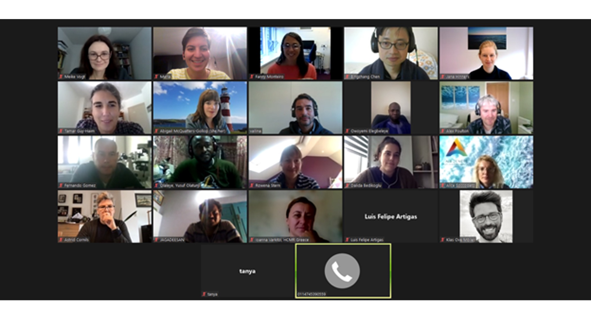
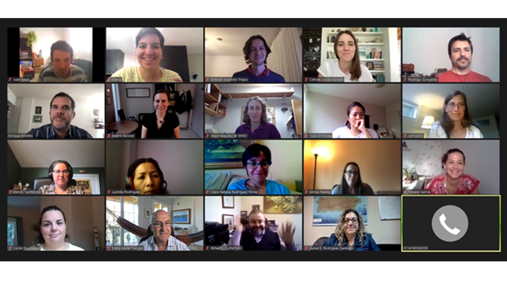
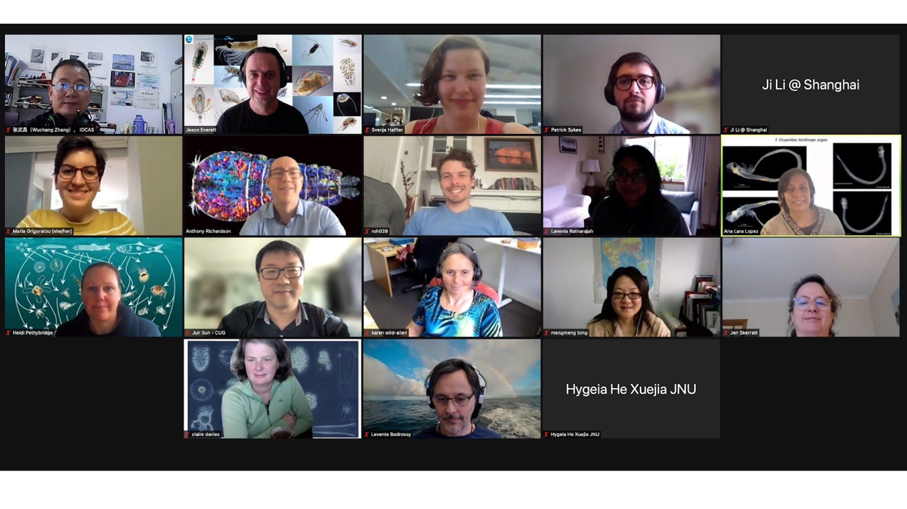

```{r setup, include=FALSE}
knitr::opts_chunk$set(echo = F, message = F, warning = F, fig.width=9.5, fig.height=12)
```

## [Marine Biodiversity Observation Network (MBON)](https://marinebon.org/)

<body>

<h3>

Much life in the sea depends on plankton diversity and production. As the ocean changes, the many ecosystem functions of plankton - their biodiversity, distribution, nutrient and carbon flows, timing of life stages and blooms - change in ways that also alter ecosystem services that other organisms, including humans, depend on. There is a need to better understand and predict how these ecosystem functions of the plankton community change on different time scales. Justifying comprehensive regional and global studies of the role of plankton biodiversity and ecosystem function will require understanding the importance of plankton in an ecosystem services framework. 

</h3>

</body>


<body>

<h3>

[MBON](https://marinebon.org/){target="_blank"} with the support of [MODIV](https://modiv.w.uib.no/){target="_blank"} organized four virtual workshops in November 2020, October and November 2021 titled: “Plankton ecosystem function, biodiversity, and forecasting - research requirements and applications”.  

The workshops brought scientists together to provide an overview of the state-of-the-art of field, lab and modelling approaches used to study plankton biodiversity and discuss data needs to improve our understanding of the value of plankton, its functions and ecosystem services. 

</h3>

</body>

<br>

## October 2021

<br>



## November 2021


<h3>

As next steps the participants decided to develop and publish: 

(1) A synthesis paper on the current limitations in data collection, analysis and accessibility, recommendations  to overcome them, and ways to create common standards for data harmonization. This will allow to align multiple research tools and approaches, data, methods, protocols and knowledge to improve ecological forecasting. This alignment is important to meet the goals of the UN Decade of Ocean Science for Sustainable Development (the Ocean Decade) through programs like Marine Life 2030, Digital Twins of the Ocean - DITTO, and Ocean Practices for the Decade.
 
(2) A perspective paper on the value of plankton, written by a coalition of peers from diverse fields (oceanography,  education, economics, art, citizen science).

For more information please contact Dr. Maria Grigoratou (maria.grigoratou1@gmail.com). 

</h3>

</body>

<br>
## Sponsored by:


