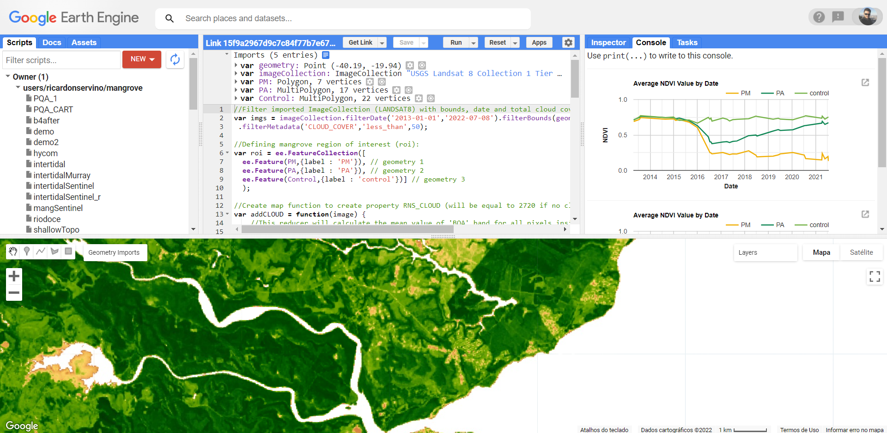

```{r setup, include=FALSE}
knitr::opts_chunk$set(echo = F, message = F, warning = F)
```

# **Todos os materiais do treinamento e as apresentações do Ocean Data Bootcamp estão disponívels aquí:** <br> <br>

## Tutorial para transformar dados de monitoramento de biodiversidade de litoral rochoso a Darwin Core.

```{r, echo = F, message = F, warning = F}
if (!require(librarian)){
  install.packages("librarian")
  library(librarian)
}
shelf(vembedr)
embed_youtube("teJhfsSWonE", width = 910, height = 910*360/640, frameborder = 0,
  allowfullscreen = TRUE, query = NULL)
```
<br> <br>

## Script para obtenção de séries de dados de sensoriamento remoto por satélite disponívels no [ERDDAP](https://coastwatch.pfeg.noaa.gov/erddap/index.html) - [SST](https://coastwatch.pfeg.noaa.gov/erddap/griddap/jplMURSST41mday.html) and [Chl-a](https://coastwatch.pfeg.noaa.gov/erddap/griddap/erdMH1chla8day.html).

<iframe src="sat_CostaDasAlgas_Rscript.html" width="760" height="800" frameborder="0" marginheight="0" marginwidth="0">Loading...</iframe>

<br> <br>

## Script para obtenção de séries de dados de sensoriamento remoto por satélite disponívels no [ERDDAP](https://coastwatch.pfeg.noaa.gov/erddap/index.html) - Paisagens marinhas ([seascapes](https://coastwatch.noaa.gov/cw/satellite-data-products/multi-parameter-models/seascape-pelagic-habitat-classification.html)).

<iframe src="seascapes_CostaDasAlgas_RScript.html" width="760" height="800" frameborder="0" marginheight="0" marginwidth="0">Loading...</iframe>

<br> <br>

## Script para obtenção de séries de dados de sensoriamento remoto por satélite disponívels no [Google Earth Engine](https://earthengine.google.com/) - O script de exemplo para análise de vegetação está disponível [aqui](https://code.earthengine.google.com/15f9a2967d9c7c84f77b7e67a5c3b7b9)



## Outros exemplos de GEE:
https://code.earthengine.google.com/a4953ea9f91988c3027d669264a3d2d6
https://code.earthengine.google.com/a1e4f4088979979d43b8ac0d95040a73
https://code.earthengine.google.com/4643fe4e6a91dca7e4878700c1078e69
https://code.earthengine.google.com/90c60baf398222d0b9147cfe204f769b

<br> <br>

## **Mais informação sobre SCOR aqui**

```{r, echo = F, message = F, warning = F}
if (!require(librarian)){
  install.packages("librarian")
  library(librarian)
}
shelf(vembedr)
embed_youtube("pRVM0x_d0tA", width = 910, height = 910*360/640, frameborder = 0,
  allowfullscreen = TRUE, query = NULL)
```
<br> <br>

mygsAakg9X4

## **A apresentação sobre indicadores de ecosistema e clima:**

```{r, echo = F, message = F, warning = F}
if (!require(librarian)){
  install.packages("librarian")
  library(librarian)
}
shelf(vembedr)
embed_youtube("uKz60V0RGXo", width = 910, height = 910*360/640, frameborder = 0,
  allowfullscreen = TRUE, query = NULL)
```
<br> <br>

## **As apresentações do workshop estāo disponívels [aqui](https://github.com/eqmh/Ocean_Data_Bootcamp/tree/main/docs/presentations)**


